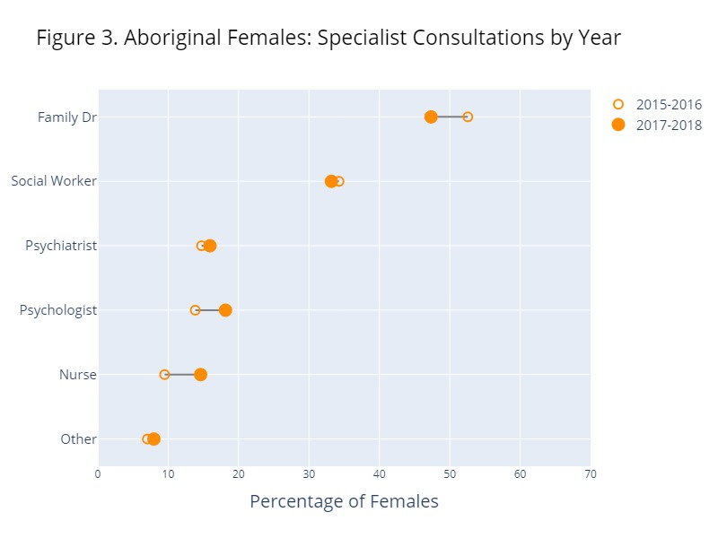
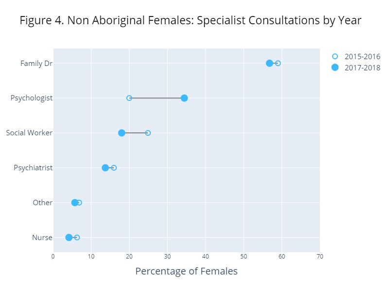

# Mental Health in Aboriginal Females vs Non-Aboriginal Females in Canada

## Description

The enduring intergenerational impact on the mental health of Indigenous communities can be traced back to the historical trauma inflicted by the residential school system [1].In Canada, studies have shown that Aboriginal women face poorer mental health outcomes than Aboriginal men [2]. Several studies also found that Aboriginal women in Canada experience significantly higher rates of depression compared to non-Aboriginal women [3]. Furthermore, Aboriginal women were also found to have a higher prevalence of pre-existing depression than non-Aboriginal women [4]. These findings suggest the importance of mental health support systems specific to First Nation women. 
To enhance cultural sensitivity and provide better support, communities need to develop resources and social services tailored to empower Indigenous women to take control of their health management [5]. A significant obstacle in attaining mental well-being for numerous Indigenous individuals is that the provided services might be insufficient or unsuitable due to the scarcity of mental health professionals who are culturally aware and informed [1]. 

Using the Canadian Community Health Survey -Annual Componet 2015-2016 and 2017-2018, the specific question I aim to answer through this project is:

- Is there a difference between the preference of mental health professionals between Aboriginal and non-Aboriginal females? Has it changed between 2015 to 2018?

The raw data can be found in https://abacus.library.ubc.ca/dataset.xhtml?persistentId=hdl:11272.1/AB2/SEB16A.

## Findings

  In both groups and regardless of the year, the professionals of choice are the family doctors. It is interesting to note that the second most consulted specialist for Aboriginal females are social workers vs psychologists for non-Aboriginal females. It can also be noted that for Aboriginal females the percentage of consultations for family doctors and social workers diminished from 2015 and 2018 and for the rest of specialists it increased. As for non-Aboriginal females, only the percentage of consultations to psychologists increased (by 14.4%) while for the rest of the specialists it decreased.

## References

1- Boksa P, Joober R, Kirmayer LJ. Mental wellness in Canada’s Aboriginal communities: striving toward reconciliation. J Psychiatry Neurosci 2015;40:363–5. https://doi.org/10.1503/jpn.150309.

2- MacMillan, H. L., Jamieson, E., Walsh, C. A., Wong, M. Y. Y., Faries, E. J., McCue, H., MacMillan, A. B., & Offord, D. R. (2008). First Nations women's mental health: results from an Ontario survey. Archives of Women's Mental Health, 11(2), 109–115. doi:10.1007/s00737-008-0004-y

3- Smylie, J., Fell, D., & Ohlsson, A. (2010). A review of Aboriginal infant mortality rates in Canada: Striking and persistent Aboriginal/non-Aboriginal inequities. Canadian Journal of Public Health, 101(2), 143–148

4- Hu M, Hajizadeh M. Mind the Gap: What Factors Determine the Worse Health Status of Indigenous Women Relative to Men Living Off-Reserve in Canada? J Racial and Ethnic Health Disparities 2023;10:1138–64. https://doi.org/10.1007/s40615-022-01301-x.

5- Eades A, Hackett ML, Liu H, Brown A, Coffin J, Cass A. Qualitative study of psychosocial factors impacting on Aboriginal women’s management of chronic disease. Int J Equity Health 2020;19:8. https://doi.org/10.1186/s12939-019-1110-3.

## License
This project is licensed under the Creative Commons Attribution-NonCommercial-ShareAlike 4.0 International License - see the [LICENSE.md] file for details.
